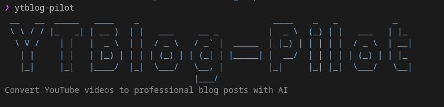
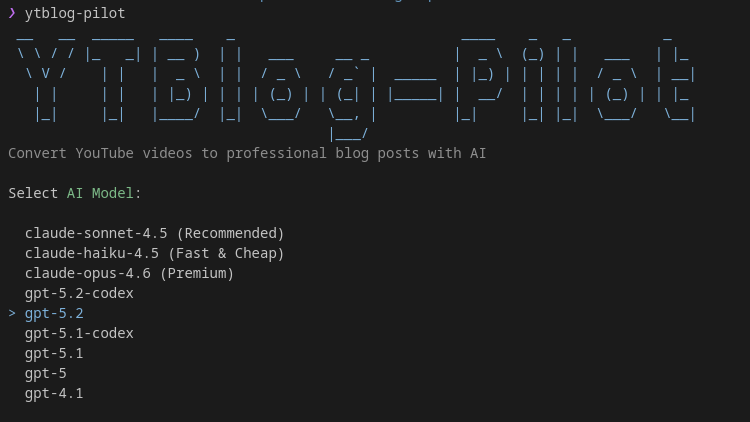
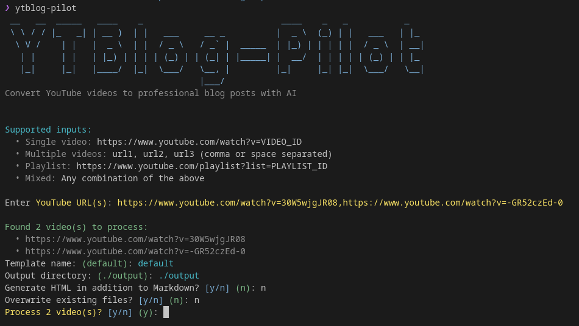
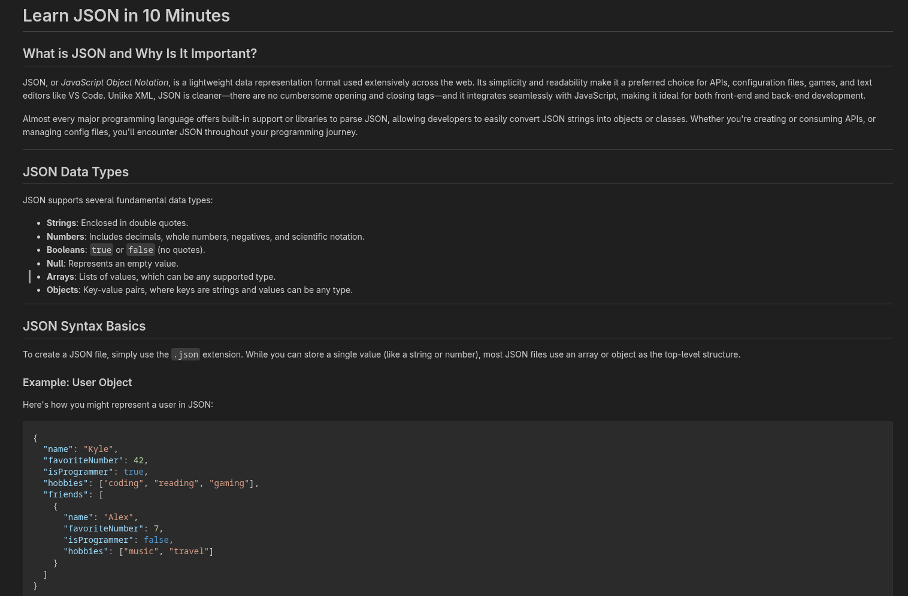

# YTBlog-Pilot 🎬✨

[](https://dotnet.microsoft.com/download/dotnet/10.0)
[](./LICENSE)
[]()

> Transform YouTube videos into professional, AI-powered blog posts with a single command.

YTBlog-Pilot is a powerful .NET 10 CLI tool that converts YouTube video transcripts into well-structured, engaging blog posts using AI models like Claude, GPT, and Gemini. Perfect for content creators, developers, and bloggers who want to repurpose video content.


*Interactive mode with AI model selection and multi-video support*

---

## ✨ Features

- 🎥 **Extract YouTube Transcripts** - Automatically fetch video transcripts and metadata
- 🤖 **AI-Powered Generation** - Choose from 16+ AI models (Claude Sonnet/Haiku/Opus, GPT-5.x, Gemini)
- 🎯 **Interactive Mode** - Beautiful CLI with guided prompts and progress tracking
- 📦 **Multi-Video Support** - Process multiple videos or entire playlists at once
- 🎬 **Playlist Expansion** - Automatically extract all videos from YouTube playlists
- 📝 **Customizable Templates** - Use built-in or create your own Markdown templates
- 🎨 **HTML Output** - Generate styled HTML alongside Markdown
- 💾 **Smart Caching** - Avoid redundant API calls with intelligent caching (7-day TTL)
- 🔄 **Retry Logic** - Automatic exponential backoff for failed requests
- ⚡ **Beautiful UI** - Powered by Spectre.Console with progress bars and spinners

---

## 📸 Screenshots

### Interactive Mode

*Step-by-step guided experience with AI model selection*

### Multi-Video Processing

*Process multiple videos or playlists in one go*

### Generated Output

*Professional blog posts with YAML frontmatter and proper formatting*

---

## 🚀 Quick Start

### Prerequisites

Before you begin, ensure you have the following installed:

1. **[.NET 10 SDK](https://dotnet.microsoft.com/download/dotnet/10.0)** (Required)
   ```bash
   # Verify installation
   dotnet --version
   # Should show: 10.0.x
   ```

2. **[GitHub Copilot CLI](https://docs.github.com/en/copilot/using-github-copilot/using-github-copilot-in-the-command-line)** (Required)
   ```bash
   # Install Copilot CLI (standalone command)
   # Visit: https://github.com/github/gh-copilot
   
   # Authenticate
   copilot login
   
   # Test it works
   copilot -p "Hello world" --allow-all
   ```

3. **GitHub Copilot Subscription** (Required for AI generation)

### Installation

#### Option 1: From Source (Recommended for now)

```bash
# 1. Clone the repository
git clone https://github.com/yourusername/ytblog-pilot.git
cd ytblog-pilot

# 2. Build the project
dotnet build

# 3. Pack and install globally
dotnet pack VideoToBlog/VideoToBlog.csproj -c Release
dotnet tool install --global --add-source ./VideoToBlog/bin/Release YTBlogPilot.CLI

# 4. Verify installation
ytblog-pilot --version
```

<!-- #### Option 2: From NuGet (Coming Soon)

```bash
dotnet tool install --global YTBlogPilot.CLI
``` -->

---

## 📖 Usage

### Interactive Mode (Recommended for Beginners)

Simply run the command without arguments:

```bash
ytblog-pilot
```

You'll be guided through:

1. **AI Model Selection** - Choose from 16+ models
   - Claude Sonnet 4.5 (Recommended) - Balanced quality and speed
   - Claude Haiku 4.5 (Fast & Cheap) - Quick processing
   - Claude Opus 4.6 (Premium) - Highest quality
   - GPT-5.2, GPT-5.1, GPT-5 variants
   - Gemini 3 Pro

2. **YouTube URLs** - Enter one or more:
   - Single video: `https://www.youtube.com/watch?v=VIDEO_ID`
   - Multiple videos: `url1, url2, url3` (comma or space separated)
   - Playlist: `https://www.youtube.com/playlist?list=PLAYLIST_ID`
   - Mixed: Any combination

3. **Template Selection** - Choose your blog template (`default`, `custom`, etc.)

4. **Output Directory** - Specify where to save files (default: `./output`)

5. **Additional Options**
   - Generate HTML alongside Markdown
   - Overwrite existing files
   - And more!

### Command-Line Mode (For Automation)

```bash
# Basic usage
ytblog-pilot https://www.youtube.com/watch?v=dQw4w9WgXcQ

# With options
ytblog-pilot <url> --html --output ./myblog --template custom --verbose

# Force overwrite
ytblog-pilot <url> --force
```

### Multi-Video Processing

```bash
# In interactive mode, enter multiple URLs:
# Single: https://www.youtube.com/watch?v=vid1
# Multiple: vid1_url, vid2_url, vid3_url
# Playlist: https://www.youtube.com/playlist?list=PLa1F2ddGya...

# The tool will:
# 1. Expand playlists to individual videos
# 2. Fetch transcripts for all videos
# 3. Generate a comprehensive blog post combining all content
```

---

## 🎨 Customization

### Templates

Create custom templates in the `templates/` directory:

```markdown
---
title: {{TITLE}}
description: {{DESCRIPTION}}
date: {{DATE}}
tags: {{TAGS}}
reading_time: {{READING_TIME}}
video_url: {{VIDEO_URL}}
---

# {{TITLE}}

{{CONTENT}}

---

*This blog post was generated from a YouTube video transcript.*
```

**Available Placeholders:**
- `{{TITLE}}` - Video title
- `{{DESCRIPTION}}` - Auto-generated description
- `{{DATE}}` - Current date
- `{{TAGS}}` - Auto-extracted tags
- `{{READING_TIME}}` - Estimated reading time
- `{{VIDEO_URL}}` - Original YouTube URL
- `{{CONTENT}}` - AI-generated blog content

### Configuration

Edit `VideoToBlog/appsettings.json`:

```json
{
  "AppSettings": {
    "CacheDirectory": ".cache",
    "CacheTtlDays": 7,
    "MaxTranscriptLength": 10000,
    "ChunkSize": 1500,
    "DefaultOutputDirectory": "./output",
    "DefaultTemplate": "default",
    "MaxRetries": 3,
    "RetryDelaySeconds": 2,
    "CopilotTimeout": 300
  }
}
```

---

## 📂 Output Format

Generated blog posts include:

- **YAML Frontmatter** with metadata (title, description, date, tags, reading time)
- **Properly Formatted Markdown** with headings, lists, code blocks
- **SEO-Friendly Description** (auto-extracted from content)
- **Auto-Generated Tags** (extracted from title and content)
- **Reading Time Estimate** (based on word count)
- **Link to Original Video**

**Example Output:**

```markdown
---
title: "10 Python Tips for Beginners"
description: "Learn essential Python tips and tricks that will boost your..."
date: 2026-02-08
tags: ["python", "tutorial", "programming"]
reading_time: 5 min read
video_url: https://www.youtube.com/watch?v=example
---

# 10 Python Tips for Beginners

## Introduction

In this comprehensive guide, we'll explore...

## 1. Use List Comprehensions

List comprehensions provide a concise way to create lists...
```

---

## 🛠️ Development

### Building from Source

```bash
# Clone and build
git clone https://github.com/yourusername/ytblog-pilot.git
cd ytblog-pilot
dotnet build

# Run tests
dotnet test

# Run locally (interactive mode)
dotnet run --project VideoToBlog/VideoToBlog.csproj

# Run locally (command-line mode)
dotnet run --project VideoToBlog/VideoToBlog.csproj -- <youtube-url> [options]
```

### Project Structure

```
ytblog-pilot/
├── .github/
│   ├── assets/              # Screenshots and images
│   └── copilot-instructions.md  # AI assistant guidelines
├── VideoToBlog/             # Main CLI project
│   ├── Commands/            # Interactive & ConvertCommand
│   ├── Services/            # Business logic
│   ├── Models/              # Data models
│   ├── Configuration/       # AppSettings
│   └── Exceptions/          # Custom exceptions
├── VideoToBlog.Tests/       # xUnit tests
├── templates/               # Blog post templates
├── output/                  # Generated blog posts
├── .cache/                  # Transcript cache
└── README.md
```

### Running Tests

```bash
# Run all tests
dotnet test

# Run specific test
dotnet test --filter FullyQualifiedName~VideoToBlog.Tests.BlogPostServiceTests.GenerateBlogPostAsync_WithValidVideoInfo_ReturnsBlogPostWithCorrectTitle

# Run with verbose output
dotnet test --logger "console;verbosity=detailed"
```

---

## 🐛 Troubleshooting

### "Copilot CLI failed" or Command Not Found

Ensure the standalone Copilot CLI is installed:

```bash
# Check if copilot is available
copilot --version

# If not, visit: https://github.com/github/gh-copilot

# Authenticate
copilot login

# Test
copilot -p "test" --allow-all
```

### "No transcript available for this video"

Some videos don't have transcripts or captions enabled. Try a different video that has closed captions.

### "Transcript exceeds maximum length"

Edit `appsettings.json` and increase the `MaxTranscriptLength` value:

```json
{
  "AppSettings": {
    "MaxTranscriptLength": 20000  // Increase this
  }
}
```

### Tool Not Found After Installation

Ensure `~/.dotnet/tools` is in your PATH:

```bash
# Add to your shell profile (~/.bashrc, ~/.zshrc, etc.)
export PATH="$PATH:$HOME/.dotnet/tools"

# Reload your shell
source ~/.bashrc  # or source ~/.zshrc
```

---

## 🤝 Contributing

Contributions are welcome! Please feel free to submit a Pull Request.

1. Fork the repository
2. Create your feature branch (`git checkout -b feature/AmazingFeature`)
3. Commit your changes (`git commit -m 'Add some AmazingFeature'`)
4. Push to the branch (`git push origin feature/AmazingFeature`)
5. Open a Pull Request

---

## 📄 License

This project is licensed under the MIT License - see the [LICENSE](LICENSE) file for details.

---

## 🙏 Acknowledgments

- [YoutubeExplode](https://github.com/Tyrrrz/YoutubeExplode) - YouTube video metadata and transcript extraction
- [Spectre.Console](https://spectreconsole.net/) - Beautiful CLI interfaces
- [Markdig](https://github.com/xoofx/markdig) - Markdown processing
- [Polly](https://github.com/App-vNext/Polly) - Resilience and retry logic
- [GitHub Copilot](https://github.com/features/copilot) - AI-powered content generation

---

## 📞 Support

- 🐛 **Issues**: [GitHub Issues](https://github.com/yourusername/ytblog-pilot/issues)
- 💬 **Discussions**: [GitHub Discussions](https://github.com/yourusername/ytblog-pilot/discussions)
- 📧 **Email**: your.email@example.com

---

<div align="center">

**Made with ❤️ by the YTBlog-Pilot Team**

[⭐ Star this repo](https://github.com/yourusername/ytblog-pilot) • [🐛 Report Bug](https://github.com/yourusername/ytblog-pilot/issues) • [✨ Request Feature](https://github.com/yourusername/ytblog-pilot/issues)

</div>

```bash
# In interactive mode, enter multiple URLs:
Enter YouTube URL(s): https://www.youtube.com/watch?v=vid1, https://www.youtube.com/watch?v=vid2

# Or a playlist URL:
Enter YouTube URL(s): https://www.youtube.com/playlist?list=PLa1F2ddGya...

# The tool will:
# 1. Expand playlists to individual videos
# 2. Fetch transcripts for all videos
# 3. Generate a comprehensive blog post combining all content
```

### Command-Line Mode (Traditional)

For scripting and automation, use command-line arguments:

```bash
# Basic usage
ytblog-pilot https://www.youtube.com/watch?v=dQw4w9WgXcQ
```

### With Options

```bash
# Generate HTML output
ytblog-pilot https://www.youtube.com/watch?v=dQw4w9WgXcQ --html

# Specify output directory
ytblog-pilot https://www.youtube.com/watch?v=dQw4w9WgXcQ --output ./my-blog-posts

# Use custom template
ytblog-pilot https://www.youtube.com/watch?v=dQw4w9WgXcQ --template custom

# Force overwrite existing files
ytblog-pilot https://www.youtube.com/watch?v=dQw4w9WgXcQ --force

# Verbose output
ytblog-pilot https://www.youtube.com/watch?v=dQw4w9WgXcQ --verbose
```

### Command-Line Options

| Option | Short | Description |
|--------|-------|-------------|
| `<youtube-url>` | | YouTube video URL (required) |
| `--template` | `-t` | Template name (default: 'default') |
| `--output` | `-o` | Output directory (default: './output') |
| `--html` | | Generate HTML output in addition to Markdown |
| `--force` | `-f` | Overwrite existing files |
| `--verbose` | `-v` | Enable verbose logging |
| `--help` | `-h` | Show help information |
| `--version` | | Show version information |

## Configuration

Edit `appsettings.json` to customize behavior:

```json
{
  "AppSettings": {
    "CacheDirectory": ".cache",
    "CacheTtlDays": 7,
    "MaxTranscriptLength": 10000,
    "ChunkSize": 1500,
    "DefaultOutputDirectory": "./output",
    "DefaultTemplate": "default",
    "MaxRetries": 3,
    "RetryDelaySeconds": 2,
    "CopilotTimeout": 300
  }
}
```

## Custom Templates

Create custom templates in the `templates/` directory. Use these placeholders:

- `{{TITLE}}` - Video title
- `{{DESCRIPTION}}` - Generated description
- `{{DATE}}` - Current date
- `{{TAGS}}` - Generated tags
- `{{READING_TIME}}` - Estimated reading time
- `{{VIDEO_URL}}` - Original YouTube URL
- `{{CONTENT}}` - Generated blog content

Example template (`templates/custom.md`):

```markdown
---
title: {{TITLE}}
description: {{DESCRIPTION}}
date: {{DATE}}
tags: {{TAGS}}
---

# {{TITLE}}

> Watch the original video: [{{VIDEO_URL}}]({{VIDEO_URL}})

{{CONTENT}}

*Reading time: {{READING_TIME}}*
```

## Output Format

Generated blog posts include:

- YAML frontmatter with metadata
- Properly formatted Markdown content
- SEO-friendly description
- Automatically extracted tags
- Reading time estimate
- Link to original video

### Troubleshooting

### "Copilot CLI failed" or Command Not Found

Ensure you have the standalone Copilot CLI installed:

```bash
# Check if copilot is available
copilot --version

# If not, download from GitHub
# Or use the gh cli integration (gh cli 2.86.0+)
gh --version

# Authenticate
copilot login
# or
gh auth login

# Test
copilot -p "test" --allow-all
```

### "No transcript available for this video"

Some videos don't have transcripts or captions enabled. Try a different video.

### "Transcript exceeds maximum length"

Edit `appsettings.json` and increase `MaxTranscriptLength` value.

## Development

### Build

```bash
dotnet build
```

### Run Tests

```bash
dotnet test
```

### Run Locally

```bash
dotnet run --project VideoToBlog/VideoToBlog.csproj -- https://www.youtube.com/watch?v=example
```

## Contributing

1. Fork the repository
2. Create a feature branch (`git checkout -b feature/amazing-feature`)
3. Commit your changes (`git commit -m 'Add amazing feature'`)
4. Push to the branch (`git push origin feature/amazing-feature`)
5. Open a Pull Request

## License

This project is licensed under the MIT License - see the LICENSE file for details.

## Acknowledgments

- [YoutubeExplode](https://github.com/Tyrrrz/YoutubeExplode) - YouTube video metadata extraction
- [Spectre.Console](https://spectreconsole.net/) - Beautiful CLI interfaces
- [Markdig](https://github.com/xoofx/markdig) - Markdown processing
- [GitHub Copilot](https://github.com/features/copilot) - AI-powered content generation

## Support

For issues and feature requests, please [create an issue](https://github.com/yourusername/ytblog-pilot/issues).
